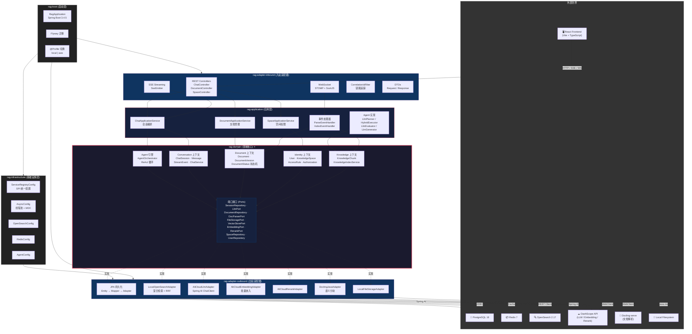

# Hexagonal Architecture — 六边形体系架构

## 整体分层视图



## 依赖规则（从内到外）

```
                    ┌─────────────────────────────┐
                    │   rag-domain (领域核心)        │  ← 最内层，零外部依赖
                    │   只依赖 reactor-core          │     只定义 Port 接口
                    └──────────────┬──────────────┘
                                   │ 依赖
                    ┌──────────────▼──────────────┐
                    │   rag-application (应用层)    │  ← 编排用例
                    │   依赖: rag-domain            │     实现 Agent 端口
                    └──────────────┬──────────────┘
                                   │ 依赖
              ┌────────────────────┼────────────────────┐
              │                    │                     │
    ┌─────────▼────────┐  ┌───────▼────────┐  ┌────────▼───────┐
    │ rag-adapter-      │  │ rag-adapter-    │  │ rag-            │
    │ inbound            │  │ outbound        │  │ infrastructure  │
    │                    │  │                 │  │                 │
    │ 依赖:              │  │ 依赖:           │  │ 依赖:           │
    │  rag-application   │  │  rag-domain     │  │  rag-domain     │
    │                    │  │  rag-infra      │  │                 │
    └────────┬───────────┘  └───────┬────────┘  └────────┬───────┘
             │                      │                     │
    ┌────────▼──────────────────────▼─────────────────────▼───────┐
    │                     rag-boot (启动层)                         │
    │   聚合所有模块，提供 main()、配置文件、Flyway 迁移              │
    └─────────────────────────────────────────────────────────────┘
```

## 关键约束

| 规则 | 说明 |
|------|------|
| **rag-domain 零框架依赖** | 不允许 import Spring、JPA、Jackson。唯一允许 reactor-core (Flux) |
| **依赖方向：外→内** | 外层依赖内层，内层不知道外层存在 |
| **Port 定义在 domain** | 所有外部服务接口定义在领域层 |
| **Adapter 实现 Port** | 出站适配器实现领域端口，通过 @Profile 切换 |
| **Application 不含业务逻辑** | 只做编排：加载→校验→调用 domain service→持久化 |
| **Entity ≠ Domain Model** | JPA Entity 在 adapter-outbound，通过 Mapper 转换，永不暴露到外层 |
