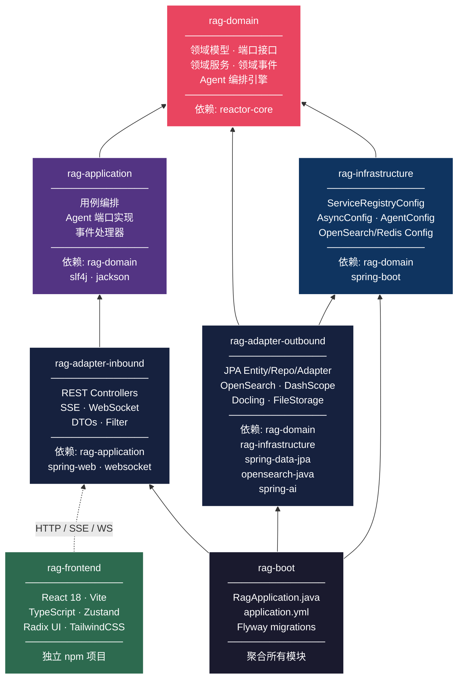

# Maven Module Dependency — 模块依赖关系

## 模块依赖图



## 依赖矩阵

| 模块 ↓ 依赖 → | domain | application | infrastructure | adapter-in | adapter-out | boot |
|:---|:---:|:---:|:---:|:---:|:---:|:---:|
| **rag-domain** | — | | | | | |
| **rag-application** | **✓** | — | | | | |
| **rag-infrastructure** | **✓** | | — | | | |
| **rag-adapter-inbound** | (传递) | **✓** | | — | | |
| **rag-adapter-outbound** | **✓** | | **✓** | | — | |
| **rag-boot** | (传递) | (传递) | **✓** | **✓** | **✓** | — |

> **✓** = 直接 Maven 依赖 &nbsp;&nbsp; **(传递)** = 通过其他模块间接获得

## 外部依赖分布

```
rag-domain
├── reactor-core          (Flux<StreamEvent> 流式响应)
└── (无其他框架依赖)

rag-application
├── rag-domain
├── slf4j-api             (日志)
└── jackson-databind      (JSON 解析)

rag-infrastructure
├── rag-domain
├── spring-boot-starter
├── spring-data-redis
└── opensearch-java

rag-adapter-inbound
├── rag-application
├── spring-boot-starter-web
├── spring-boot-starter-websocket
└── spring-boot-starter-validation

rag-adapter-outbound
├── rag-domain
├── rag-infrastructure
├── spring-boot-starter-data-jpa
├── spring-ai-openai-spring-boot-starter
├── opensearch-java
└── spring-boot-starter-webflux (WebClient)

rag-boot
├── (所有模块)
├── spring-boot-starter
├── flyway-core
└── postgresql (driver)
```
