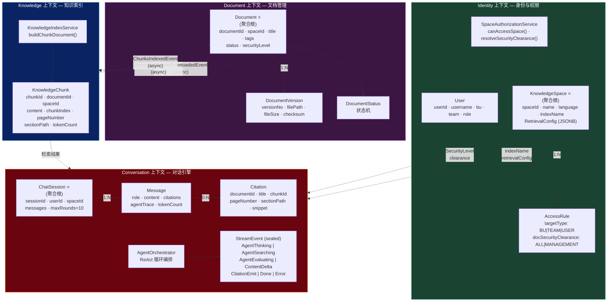
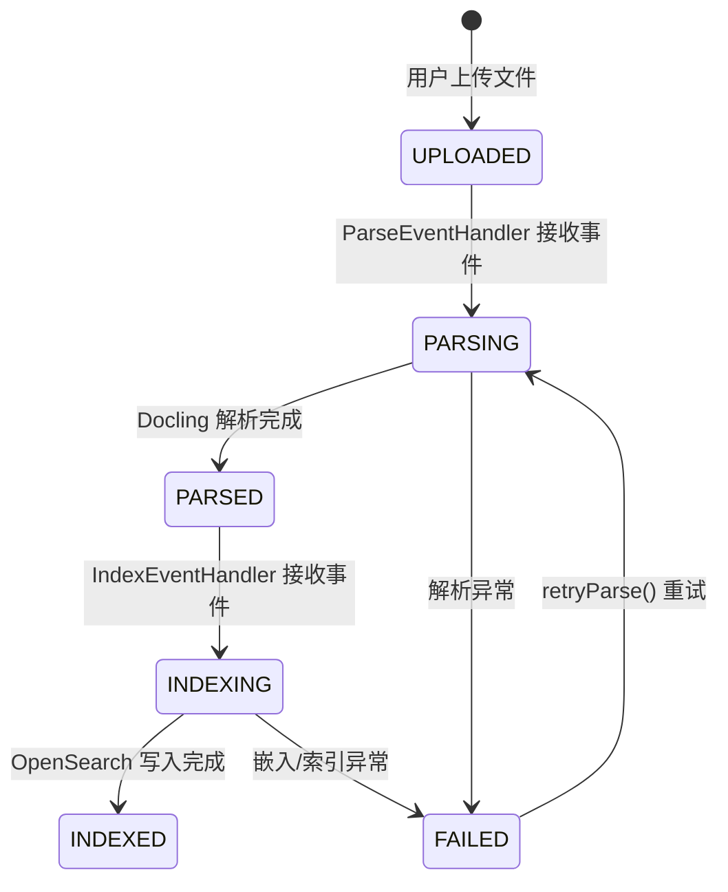

# Bounded Contexts — 领域边界与聚合

## 四大限界上下文



## 聚合根与端口

| 上下文 | 聚合根 | 包路径 | 端口 (Port) |
|:---|:---|:---|:---|
| **Identity** | `User`, `KnowledgeSpace` | `com.rag.domain.identity` | `UserRepository`, `SpaceRepository` |
| **Document** | `Document` (含 versions) | `com.rag.domain.document` | `DocumentRepository`, `DocParserPort`, `FileStoragePort` |
| **Knowledge** | `KnowledgeChunk` | `com.rag.domain.knowledge` | `VectorStorePort`, `EmbeddingPort`, `RerankPort` |
| **Conversation** | `ChatSession` (含 messages) | `com.rag.domain.conversation` | `SessionRepository`, `LlmPort` |

## 跨上下文通信 — 领域事件流

```
Document 上下文                    Knowledge 上下文                 前端
    │                                  │                            │
    │  DocumentUploadedEvent           │                            │
    ├─────────────────────────────────►│                            │
    │              (ParseEventHandler) │                            │
    │                                  │ 解析文件                    │
    │                                  │ 语义分块                    │
    │                                  │                            │
    │  DocumentParsedEvent             │                            │
    ├─────────────────────────────────►│                            │
    │              (IndexEventHandler) │                            │
    │                                  │ 批量嵌入                    │
    │                                  │ 写入 OpenSearch             │
    │                                  │                            │
    │  ChunksIndexedEvent              │                            │
    │◄─────────────────────────────────┤                            │
    │                                  │                            │
    │  WebSocket 通知                                               │
    ├──────────────────────────────────────────────────────────────►│
    │  (DocumentStatusNotifier)                                     │
```

## 状态机 — Document Lifecycle



## 关键值对象

### RetrievalConfig (JSONB, 存储在 KnowledgeSpace)
```json
{
  "maxAgentRounds": 3,
  "chunkingStrategy": "SEMANTIC",
  "metadataExtractionPrompt": "Extract key entities..."
}
```

### StreamEvent (sealed interface, 7 种类型)
```
AgentThinking(round, content)      → SSE event: agent_thinking
AgentSearching(round, queries)     → SSE event: agent_searching
AgentEvaluating(round, sufficient) → SSE event: agent_evaluating
ContentDelta(delta)                → SSE event: content_delta
CitationEmit(citation)             → SSE event: citation
Done(messageId, totalCitations)    → SSE event: done
Error(code, message)               → SSE event: error
```
