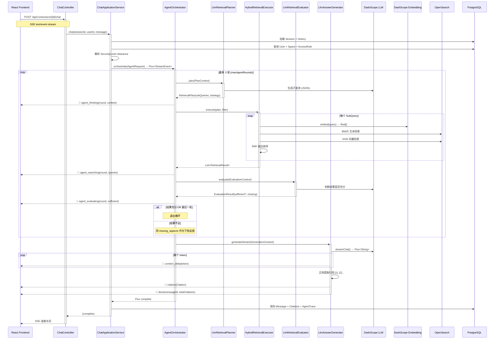
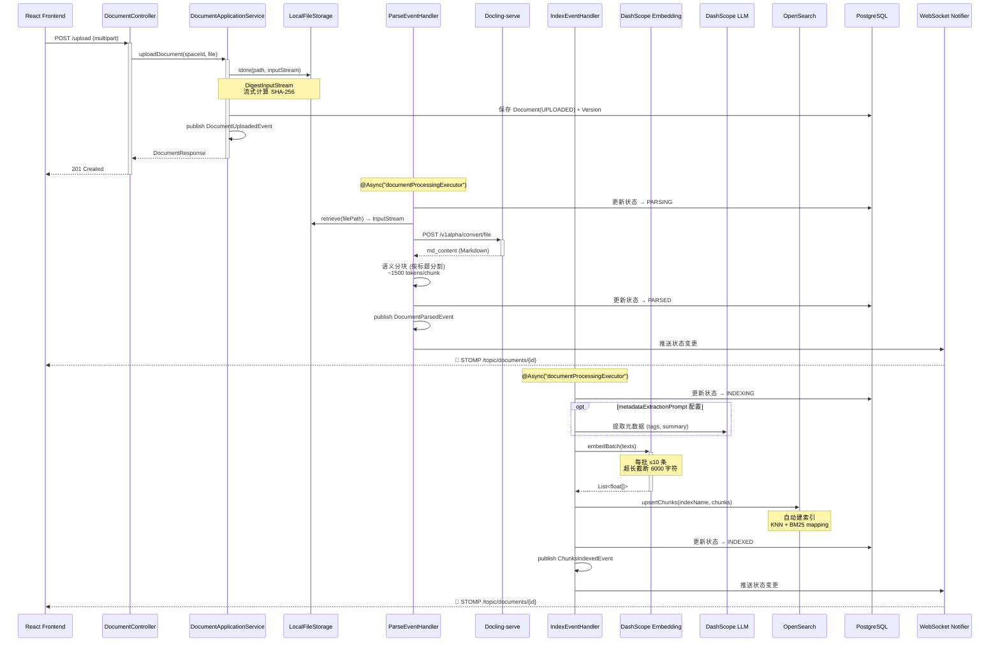
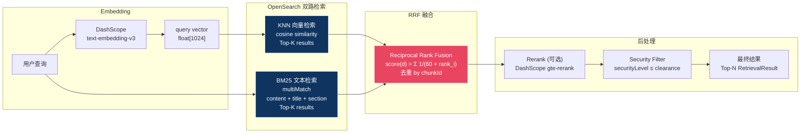
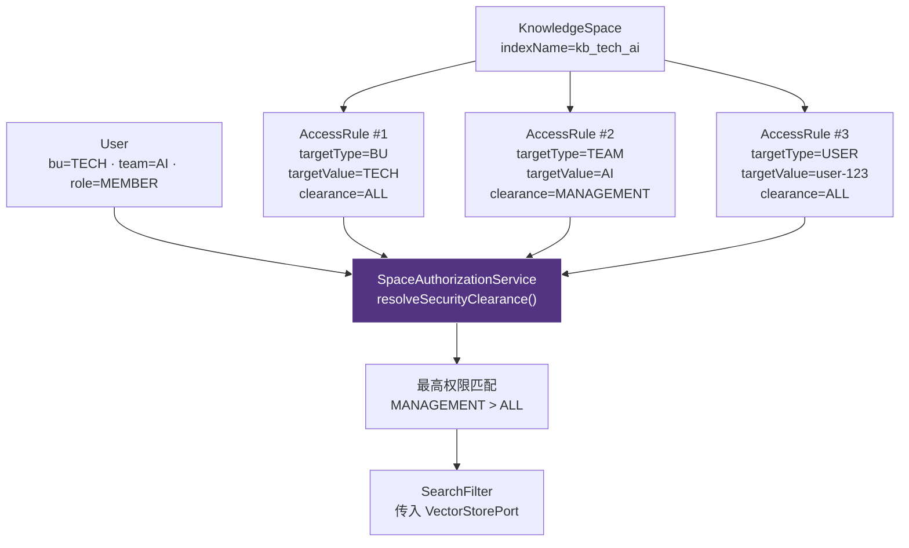

# Data Flow — 核心数据流

## 1. 聊天请求全链路 (Chat Flow)

```mermaid
sequenceDiagram
    participant FE as React Frontend
    participant Ctrl as ChatController
    participant App as ChatApplicationService
    participant Orch as AgentOrchestrator
    participant Plan as LlmRetrievalPlanner
    participant Exec as HybridRetrievalExecutor
    participant Eval as LlmRetrievalEvaluator
    participant Gen as LlmAnswerGenerator
    participant LLM as DashScope LLM
    participant Emb as DashScope Embedding
    participant OS as OpenSearch
    participant DB as PostgreSQL

    FE->>+Ctrl: POST /api/v1/sessions/{id}/chat
    Note over FE,Ctrl: SSE text/event-stream
    Ctrl->>+App: chat(sessionId, userId, message)
    App->>DB: 加载 Session + History
    App->>DB: 查询 User + Space + AccessRule
    App->>App: 解析 SecurityLevel clearance

    App->>+Orch: orchestrate(AgentRequest) → Flux<StreamEvent>

    loop 最多 3 轮 (maxAgentRounds)
        Orch->>+Plan: plan(PlanContext)
        Plan->>LLM: 生成子查询 (JSON)
        Plan-->>-Orch: RetrievalPlan(subQueries, strategy)
        Orch-->>FE: 🔔 agent_thinking(round, content)

        Orch->>+Exec: execute(plan, filter)
        loop 每个 SubQuery
            Exec->>Emb: embed(query) → float[]
            Exec->>OS: BM25 文本检索
            Exec->>OS: KNN 向量检索
            Exec->>Exec: RRF 融合排序
        end
        Exec-->>-Orch: List<RetrievalResult>
        Orch-->>FE: 🔔 agent_searching(round, queries)

        Orch->>+Eval: evaluate(EvaluationContext)
        Eval->>LLM: 判断结果是否充分
        Eval-->>-Orch: EvaluationResult(sufficient?, missing)
        Orch-->>FE: 🔔 agent_evaluating(round, sufficient)

        alt 结果充分 OR 最后一轮
            Note over Orch: 退出循环
        else 结果不足
            Note over Orch: 将 missing_aspects 作为下轮反馈
        end
    end

    Orch->>+Gen: generateStream(GenerationContext)
    Gen->>LLM: streamChat() → Flux<String>
    loop 每个 token
        Gen-->>FE: 🔔 content_delta(token)
    end
    Gen->>Gen: 正则提取引用 [1], [2]...
    Gen-->>FE: 🔔 citation(Citation)
    Gen-->>-FE: 🔔 done(messageId, totalCitations)

    Orch-->>-App: Flux complete

    App->>DB: 保存 Message + Citations + AgentTrace
    App-->>-Ctrl: (complete)
    Ctrl-->>-FE: SSE 连接关闭
```

## 2. 文档处理流水线 (Document Pipeline)

```mermaid
sequenceDiagram
    participant FE as React Frontend
    participant Ctrl as DocumentController
    participant App as DocumentApplicationService
    participant FS as LocalFileStorage
    participant Parse as ParseEventHandler
    participant Docling as Docling-serve
    participant Index as IndexEventHandler
    participant Emb as DashScope Embedding
    participant LLM as DashScope LLM
    participant OS as OpenSearch
    participant DB as PostgreSQL
    participant WS as WebSocket Notifier

    FE->>+Ctrl: POST /upload (multipart)
    Ctrl->>+App: uploadDocument(spaceId, file)
    App->>FS: store(path, inputStream)
    Note over App,FS: DigestInputStream<br/>流式计算 SHA-256
    App->>DB: 保存 Document(UPLOADED) + Version
    App->>App: publish DocumentUploadedEvent
    App-->>-Ctrl: DocumentResponse
    Ctrl-->>-FE: 201 Created

    Note over Parse: @Async("documentProcessingExecutor")
    Parse->>DB: 更新状态 → PARSING
    Parse->>FS: retrieve(filePath) → InputStream
    Parse->>+Docling: POST /v1alpha/convert/file
    Docling-->>-Parse: md_content (Markdown)
    Parse->>Parse: 语义分块 (按标题分割)<br/>~1500 tokens/chunk
    Parse->>DB: 更新状态 → PARSED
    Parse->>Parse: publish DocumentParsedEvent
    Parse->>WS: 推送状态变更
    WS-->>FE: 🔔 STOMP /topic/documents/{id}

    Note over Index: @Async("documentProcessingExecutor")
    Index->>DB: 更新状态 → INDEXING

    opt metadataExtractionPrompt 配置
        Index->>LLM: 提取元数据 (tags, summary)
    end

    Index->>+Emb: embedBatch(texts)
    Note over Emb: 每批 ≤10 条<br/>超长截断 6000 字符
    Emb-->>-Index: List<float[]>

    Index->>OS: upsertChunks(indexName, chunks)
    Note over OS: 自动建索引<br/>KNN + BM25 mapping
    Index->>DB: 更新状态 → INDEXED
    Index->>Index: publish ChunksIndexedEvent
    Index->>WS: 推送状态变更
    WS-->>FE: 🔔 STOMP /topic/documents/{id}
```

## 3. 混合检索 — RRF 融合

```mermaid
graph LR
    Q["用户查询"]

    subgraph Embedding
        Q --> Emb["DashScope<br/>text-embedding-v3"]
        Emb --> Vec["query vector<br/>float[1024]"]
    end

    subgraph "OpenSearch 双路检索"
        Vec --> KNN["KNN 向量检索<br/>cosine similarity<br/>Top-K results"]
        Q --> BM25["BM25 文本检索<br/>multiMatch<br/>content + title + section<br/>Top-K results"]
    end

    subgraph "RRF 融合"
        KNN --> RRF["Reciprocal Rank Fusion<br/>score(d) = Σ 1/(60 + rank_i)<br/>去重 by chunkId"]
        BM25 --> RRF
    end

    subgraph "后处理"
        RRF --> Rerank["Rerank (可选)<br/>DashScope gte-rerank"]
        Rerank --> Filter["Security Filter<br/>securityLevel ≤ clearance"]
        Filter --> Result["最终结果<br/>Top-N RetrievalResult"]
    end

    style RRF fill:#e94560,stroke:#fff,color:#fff
    style KNN fill:#0f3460,stroke:#fff,color:#fff
    style BM25 fill:#0f3460,stroke:#fff,color:#fff
```

## 4. 权限模型

```mermaid
graph TD
    User["User<br/>bu=TECH · team=AI · role=MEMBER"]

    Space["KnowledgeSpace<br/>indexName=kb_tech_ai"]

    R1["AccessRule #1<br/>targetType=BU<br/>targetValue=TECH<br/>clearance=ALL"]
    R2["AccessRule #2<br/>targetType=TEAM<br/>targetValue=AI<br/>clearance=MANAGEMENT"]
    R3["AccessRule #3<br/>targetType=USER<br/>targetValue=user-123<br/>clearance=ALL"]

    Space --> R1
    Space --> R2
    Space --> R3

    User --> Check["SpaceAuthorizationService<br/>resolveSecurityClearance()"]
    R1 --> Check
    R2 --> Check
    R3 --> Check

    Check --> Result["最高权限匹配<br/>MANAGEMENT > ALL"]
    Result --> Filter["SearchFilter<br/>传入 VectorStorePort"]

    style Check fill:#533483,stroke:#fff,color:#fff
```
