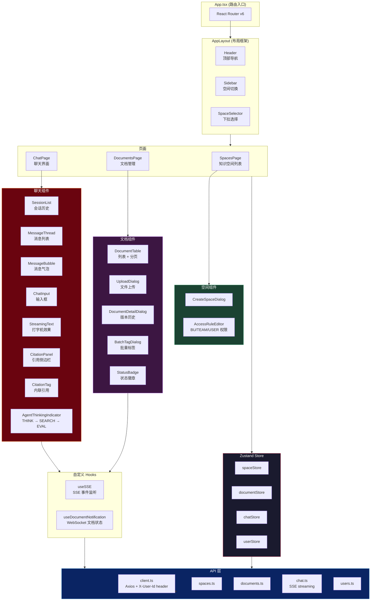

# Frontend Architecture — 前端架构

## 技术栈

| 技术 | 用途 |
|:---|:---|
| React 18 | UI 框架 |
| TypeScript | 类型安全 |
| Vite | 构建工具 + HMR |
| Zustand | 状态管理 |
| Radix UI (shadcn/ui) | 无头组件库 |
| TailwindCSS | 原子化 CSS |
| Axios | HTTP 客户端 |
| React Router v6 | 路由 |
| STOMP / SockJS | WebSocket 实时通知 |
| EventSource | SSE 流式聊天 |

## 组件架构



## SSE 聊天流式通信

```
Frontend (useSSE hook)                    Backend (ChatController)
        │                                        │
        │  POST /api/v1/sessions/{id}/chat       │
        │  Accept: text/event-stream             │
        ├───────────────────────────────────────►│
        │                                        │
        │  event: agent_thinking                 │
        │  data: {"round":1,"content":"..."}     │
        │◄───────────────────────────────────────┤
        │  → AgentThinkingIndicator: "思考中"     │
        │                                        │
        │  event: agent_searching                │
        │  data: {"round":1,"queries":["..."]}   │
        │◄───────────────────────────────────────┤
        │  → AgentThinkingIndicator: "检索中"     │
        │                                        │
        │  event: agent_evaluating               │
        │  data: {"round":1,"sufficient":true}   │
        │◄───────────────────────────────────────┤
        │  → AgentThinkingIndicator: "评估中"     │
        │                                        │
        │  event: content_delta                  │
        │  data: {"delta":"根据"}                 │
        │◄───────────────────────────────────────┤
        │  event: content_delta                  │
        │  data: {"delta":"文档"}                 │
        │◄───────────────────────────────────────┤
        │  → StreamingText: 逐字显示             │
        │                                        │
        │  event: citation                       │
        │  data: {"documentId":"...","title":..} │
        │◄───────────────────────────────────────┤
        │  → CitationPanel: 展示引用              │
        │                                        │
        │  event: done                           │
        │  data: {"messageId":"...","total":3}   │
        │◄───────────────────────────────────────┤
        │  → 消息标记完成                          │
        │                                        │
```

## Vite Dev Proxy

```typescript
// vite.config.ts
export default defineConfig({
  server: {
    port: 3000,
    proxy: {
      '/api': {
        target: 'http://localhost:8080',
        changeOrigin: true,
      },
      '/ws': {
        target: 'http://localhost:8080',
        ws: true,  // WebSocket 代理
      },
    },
  },
})
```

开发时前端 `:3000` 自动代理到后端 `:8080`，无需 CORS 配置。
